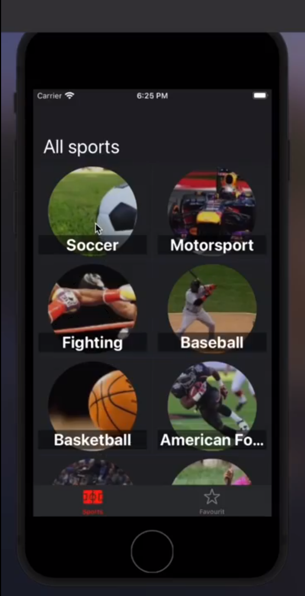
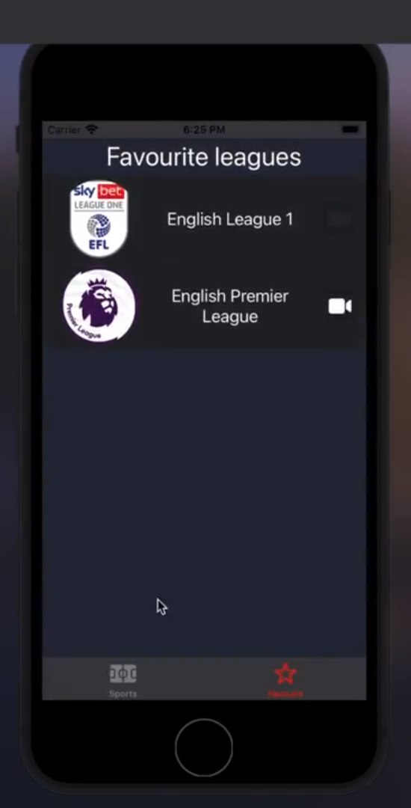
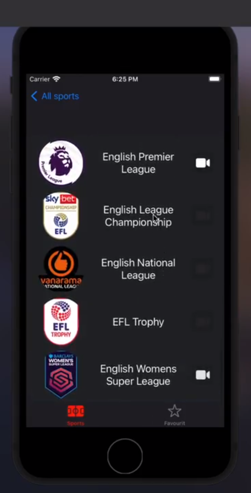
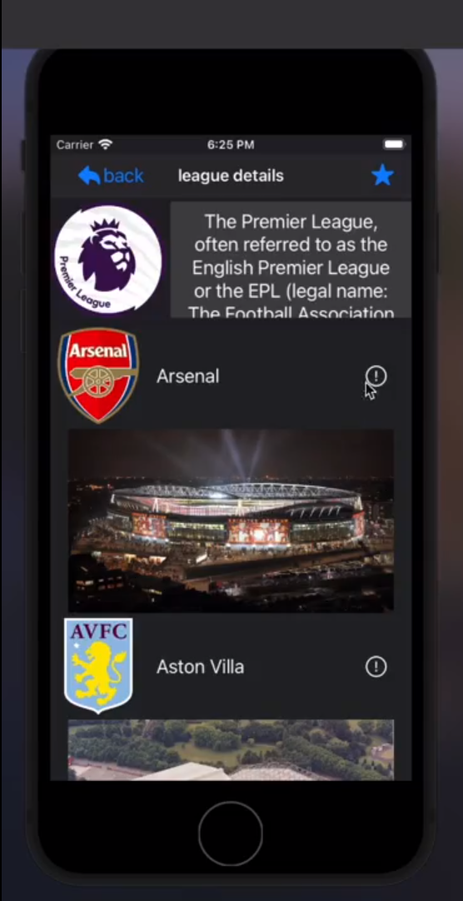
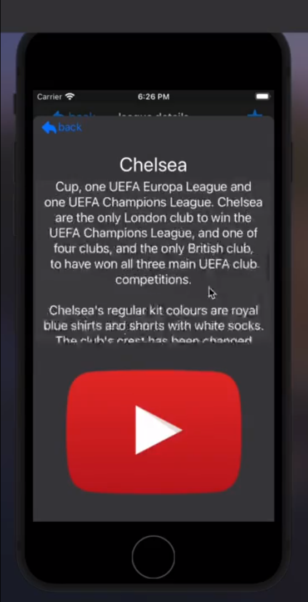
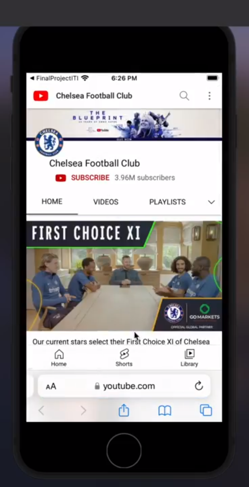

# Sports App

## 📹 Video Demo : [IOS Sports App](https://drive.google.com/file/d/1RDvUBcr2Yk69TCskbyaYqdOx-J6GaYU2/view?usp=sharing)

## ✨ Features :

- 🔄 Local Database using Core Data.
- 📲 Navigation Controller for seamless navigation between screens.
- 🌐 Alamofire integration for handling network requests.
- 📝 CRUD Operations (Create, Read, Update, Delete) for managing favorite teams.
- 📱 YouTube Player for playing videos.

## Technologies and Tools Used:

- 📱 Swift
- 📱 Storyboard
- 📱 CocoaPods
- 📱 UIKit
- 📱 Xcode

## 🏗️ Architecture: MVC

## 📸 Screenshots :

  
  

##